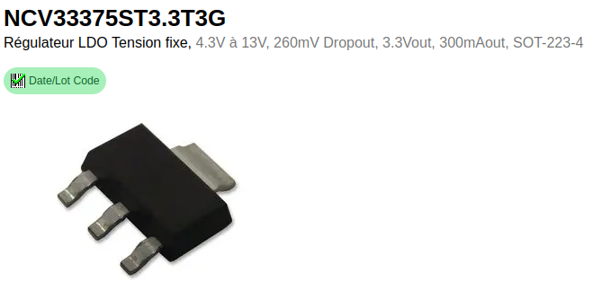
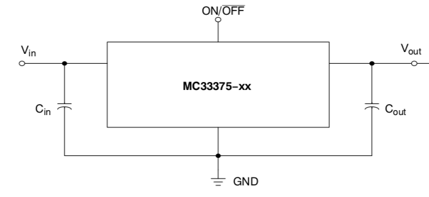
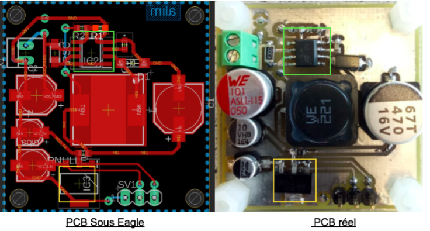
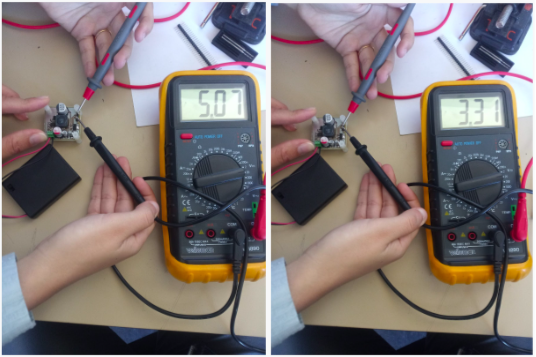

# Rachidi Inass, Cottar Manon

# Projet Batterie
# Sommaire 
### Introdcution
### I) L'alimentation
##### A) Cahier des charges
##### B) Piles et batterie 
### II) Développement du PCB
##### A) Régulateur Buck
##### B) Régulateur linéaire
##### C)Points Tests
### III) Les résultats
##### A) PCB de l’alimentation
##### B) Résultat du 6V
##### C) Résultat du 12V
### IV) Remarques 
##### A) Les chiffres
##### B) Nos erreurs
### Conclusion

### Introduction

Dans ce premier projet d'école d'ingénieur, il nous a été demandé de créer trois alimentations pour trois projets d'électronique différents.
Notre but, était donc de créer et réaliser un PCB opérationnel qui alimentera en tension et courant les composants utiles à la conception de ces projets.
Pour se faire, nous allons travailler sur un logiciel : Eagle 

### I) L'alimentation
##### A) Cahier des charges 

Il est nécessaire d'éditer un cahier des charges avant chaque début de projet. En effet, chacun d'eux est constitué de différents composants qui ont tous des caractéristiques d'alimentation, et de courant délivré qui leur sont propre. 

Nous avons donc répertorié tous les composants suivant leur datasheet

- Lorawan      5V 
               111 mA (transmission)
               2,1 µA (veille)
               6,7mA (Réception)

- STM32        3,3V
               50mA

- GPS          3,3v
               <25mA

- Accéléromètre 3,3V
                3,9mA

- Capteur humidité 5V
                   <1,5mA

- Capteur PH          5V

- Capteur température 3,3V
                      <100mA
 
 Il a également fallu déterminer l'autonomie que devait avoir l'alimentation pour chaque projet. 
 - 8h pour le travailleur isolé
 - 10h pour le badge Alzeihmer
 - 15h pour le composte

C'est avec ces renseignements que nous avons pu choisir les piles ou batteries utiles et adéquates.

##### B) Piles et batterie

L'avantage de notre projet actuel est que l'on a utilisé des piles non rechargeables qui nous délivraient les 6V voulus, tandis que les piles rechargeables, elles ne peuvent délivrer que 1,2V chacune ce qui ne fera pas exactement 6V en tension d'entrée. Cependant, qui dit piles non rechargeables dis moins d'autonomie; ce qui ne coincidera pas avec les attentes de l'acheteur si l'on commercialise le projet.

12V pour plus d'autonomie(contrainte de poids)

NB:Il est possible d'utiliser des piles rechargeables qui pourront delivrer du 4,8V (4 * 1,2V vu qu'on utilise un boitier pour 4 piles) mais dans ce cas on est obligé d'utiliser un régulateur BOOST afin de faire augmenter la tension jusqu'à 5V. Cette decision est possible mais pourra causer d'autres contraintes surtout que ce type de régulateur nécessite plus de composants ce qui veut dire que la partie alimentation va couter plus cher et va prendre plus d'espace ce qui n'est pas souhaiter pour le travailleur isolé ainsi que le badge alzheimer.
### II) Développement du PCB
##### A) Régulateur Buck
##### Pourquoi ? 

Comme vu dans le cahier des charges, nous avons plusieurs composants à alimenter. Les deux tensions à délivrer sont le 5V et le 3,3V. 
Pour cela, nous avions deux choix de régulateurs; soit un Buck (tension de sortie, du régulateur, abaissée) ou un régulateur Boost (le contraire; tension de sortie du régulateur augmentée, il inverse la tension). 

Sachant que, pour le composte, la batterie délivre 12V, le choix du régulateur Buck était alors une évidence. 
Nous avons, de plus, pris la décision de rester sur ce type de régulateur pour les deux autres projets.

Nous avons, donc, opté pour un MC34063A/E
Pourquoi ? 

- courant de sortie supérieur à 1,5mA, 
- large plage de tension d’entrée (3V-40V), sortie (0,8V-18V)
- Moins cher
- En stock
- capable du Boost et du Buck (option en plus)

 ##### L'environnement
 
Cependant, afin d’abaisser la tension, un simple régulateur dans un circuit électrique ne suffit pas. Il a besoin d’un environnement pour mener à bien sa mission. 
En effet, d’après la datasheet, de nombreux composants sont nécessaires.

En se référant à la datasheet du régulateur. 

Détaillons chacun d’eux : 

- Un résistance Rsc de 0,33 Ohm . Celle-ci permet de contrôler le courant maximal arrivant dans la pin Switch. 
- Un condensateur C2 (100µF) polarisé ; filtrage de parasites 
- Un condensateur C1(470µF) polarisé; filtrage de tension de sortie
- Une bobine ( 220µH); filtrage de courant de sortie. *
bobine en série et capa en parallèle = lissage 
- Une diode (40V) reliée à la masse, à la sortie de la switch. Elle agit comme une sécurité. En effet, si la tension dépasse 40V, alors tout passe par la diode et va à la masse. Cette valeur de tension peut paraître inatteignable de prime abord, car nous délivrons au maximum 12V en entrée, mais le On Off de la switch augmente la tension et peut atteindre ces 40V.
- Un condenstaur C3 (470pF) non polarisé; capa de synchronisation de charge et décharge du régulateur.
- 2 résistances R1 et R2. L'association de ces deux résistances forme un pont diviseur de tension, (pont diviseur de tension = abaisser une tension sans consommer de puissance).
A elles deux elles vont déterminer la tension de sortie du régulateur. En effet, lorsque l’on analyse “plus en profondeur” le régulateur en lui même, nous nous apercevons qu’il y un comparateur 1,25 tension de référence du régulateur. C’est cette comparaison qui va faire VOUT. 
On doit agir sur R1 et R2 pour VOUT. 

L’association de C2, C1 et la bobine permet au régulateur d’être le plus stable possible. 

(Chaque valeur des composants est déterminée suivant la datasheet).  

##### B) Régulateur linéaire
###### Pourquoi?
Tout comme le montre le cahier des charges du travailleur isolé, on a besoin d’alimenter la
carte STM32 ainsi que les deux capteurs GPS et Accéléromètre avec une tension de 3,3V.
Pour avoir cette tension de sortie, on pourra refaire le même régulateur BUCK pour passer
du 6V au 3,3V ou bien du 5V au 3,3V.
Pour des raisons de coût ainsi que d’optimisation d’espace sur le PCB, on a plutôt opté pour
un régulateur linéaire.

Contraintes:
Les limites d'utilisation du régulateur linéaire sont liées aux contraintes thermiques, car ce
dernier chauffe. Et il peut chauffer beaucoup ! La dissipation thermique du composant est
proportionnelle à la différence de tension qui règne entre son entrée et sa sortie, et du
courant qui le parcourt.
=> Donc est ce que celà peut nous causer un problème? Dans notre cas, pour éviter ce
soucis, on a relié le régulateur linéaire avec le BUCK pour avoir comme tension d’entrée de
ce régulateur un 5V au lieu de 6V. Ainsi, on minimise la différence de tension entre son
entrée et sa sortie. De plus, concernant le courant; le régulateur choisi ne fournit que 300mA
et on ne consomme 100mA maximum.
On choisit alors:

Ainsi grâce à ce choix: 
  -Le régulateur nous délivre une tension de sortie de 3,3V pour alimenter les différents composants.

  -Il nous délivre un courant de 300mA suffisant (sachant que la STM32 consomme du 50mA; l'accéléromètre du 3,9mA; et le GPS un courant inférieur à 25mA).

  -On a eu une livraison rapide vu que le composant était en stock.

  -On a optimisé de l’espace vu que ce régulateur ne nécessite pas beaucoup de composants contrairement au BUCK.

###### Alimentation:
En se référant sur la datasheet du NCV33375:

L’une des caractéristiques de ce régulateur est:

-Les deux condensateurs Cin et Cout servent à linéariser respectivement la tension d’entrée et de sortie.

-Si la pin ON/OFF reste flottante alors le régulateur ne marche pas, il est nécessaire de lui appliquer une tension. Pour éviter toute contrainte, on relie cette pin à Vin.  

##### C)Points Tests

Afin de vérifier le bon fonctionnement du module alimentation, nous avons créé des points tests sur le PCB. Ceux-ci vont permettre de tester les tensions de sortie de chaque régulateur. Ils apparaissent comme des débuggueurs de régulateurs. 
Pour se faire nous avons inséré une résistance nulle à la sortie du régulateur Buck. Celle-ci pouvant être soudée et dessoudée en fonction de ce que l’on souhaite faire. En effet, si elle est dessoudée, nous pouvons vérifier la tension de sortie du régulateur grâce à un multimètre. En la soudant, elle va permettre de lier les deux régulateurs entre eux. En fait, elle se comporte comme un lien entre les deux régulateurs. 

Nous avons également choisi de mettre 3 pins dans le PCB. Une pin Masse, une pin 3,3V et une pin 5V. Chaque pin étant reliée à la sortie du régulateur correspondant. 

Nous verrons plus tard, que lors de l'association sur le PCB de l'alimentation avec les autres modules (capteurs, lorawan...), la résistance nulle nous aura été bien utile pour vérifier le bon fonctionnement du régulateur Buck et ainsi résoudre quelques problèmes. 

Les composants trouvés, les datasheets analysées et les points tests ajoutés, nous avons pu réaliser notre PCB sous Eagle. 

### III) Résultats:
##### A) PCB de l’alimentation
Il nous a été conseillé de réalisé notre PCB avec résistances en 0603 car pas de consommation de puissance et économie de place.
Le PCB étant vérifié, nous avons pu lancer "la commande". Lorsque nous l'avons reçu, nous avons pu le souder en suivant le Board sous Eagle. 

En vert le régulateur BUCK
En orange le régulateur linéaire

Le PCB fini, nous avons pu passer à l'étape de vérification sous 6V et 12v de tension d'entrée. 
##### B) Les résultats en 6V et 12V

Pour vérifier ces tensions nous nous sommes servi d'un multimètre pointé sur les 3pins du connecteur. 

Nous avons bien les résultats attendus. Nous avons ensuite analysé ces résultats avec un oscilloscope. 

##### C) Les résultats à l'oscilloscope

Pour se faire, nous avons mis une sonde à la sortie du régulateur buck; soit l'entrée de la bobine; et une à la sortie de la bobine. 
Nous avons obtenu : 

Le signal jaune est la réponse en sortie du régulateur avant le lissage de la bobine.C'est la retranscription même de l'effet de la pin Switch (il y a un petit dépassement; certainement dû à l'usage des piles)
Le signal en violet est la réponse en sortie de la bobine. Nous voyons bien son effet sur le lissage du signal. 

De plus, nous remarquons bien que nous avons les 5V en sortie souhaités. ( les deux signaux se superposent); Notre PCB fonctionne.  

#### D) Les résultats du PCB de tout un projet

Notre PCB étant opérationnel, nous avons pu l'insérer dans celui du projet "Travailleur isolé".
Une fois commandé et soudé, nous avons vérifié que tout fonctionnait.

Grand désarois quand nous avons vu que ce n'était pas le cas... :)
En effet, les tensions de sorties n'étaient pas bonnes; 5V à la sortie du régulateur linéaire...

C'est à ce moment là que la résistance nulle nous a été bien utile.
En pouvant la dessouder, nous avons d'abord pu mesurer la tension de sortie du régulateur Buck indépendnat du reste du circuit. Cette tension était correcte. 
Puis, nous avons vérifié qu'il n'y avait pas de court-circuit et l'avons re-soudée pour établir le lien entre les deux régulateurs. 

Nous avons alors pris la tension de sortie du régulateur linéaire qui étonnement n'était pas à 3,3V mais à 5V. Après mainte recherches nous en avons conclu que le problème venait du microprocesseur qui avait brûlé le régulateur linéaire. 

### IV) Remarques
##### A) Les chiffres

Nous avons chiffré le coût de fabrication de l'alimentation. 

Ce qui revient la plus cher est donc les piles. Une solution pour y remédier ? 
Nous aurions pu utiliser un régulateur Boost avec moins de piles et des rechargeables. Cependant, le régulateur Boost a besoin de plus de composants que le Buck, ce qui ne coincide pas avec le fait de réduire le budget, et ne répondra pas à la contrainte d'espace imposée par le cahier des charges du travailleur isolé et du badge Alzeihmer.  
###### B) Nos erreurs : 

Dans cette partie de rapport nous avons répertorié les quelques erreurs et remarques que nous avons faites lors du projet. 

- Ne pas omettre le plan de masse sur Eagle
- Prêter attention à la largeur des pistes car la machine de l’Ensea ne peut en faire des trop petites. C’est pourquoi le premier PCB n’était pas exploitable. 
- Le via a proximité des pins SV1 n’était pas connecté au plan de masse; on a soudé un fil entre le via et celui-ci. 
- Ne pas confondre Masse et Terre 
- Ne pas confondre stabilité du régulateur Buck et linéarité du régulateur linéaire. 

NB : Avoir de bons yeux pour souder les résistances en 0603 :)

### Conclusion

A ce jour, notre projet d'alimentation est encore incomplet. En effet, indépendemment de tous les autres composants ou capteurs, elle fonctionne mais lorsqu'on l'insère dans un PCB complet, quelques problèmes surviennent.
Nous supposons que cela est dû aux autres composants qui consomment du courant, ou sont mal soudés. 
Il aurait été interessant d'avoir plus de temps pour chercher nos erreurs et ainsi faire fonctionner les différents projets. 

Par ailleurs,ce premier projet a été pour nous l'occasion de mettre à disposition nos différentes connaissances acquises et de travailler en groupe en échangeant et régroupant nos idées. 
